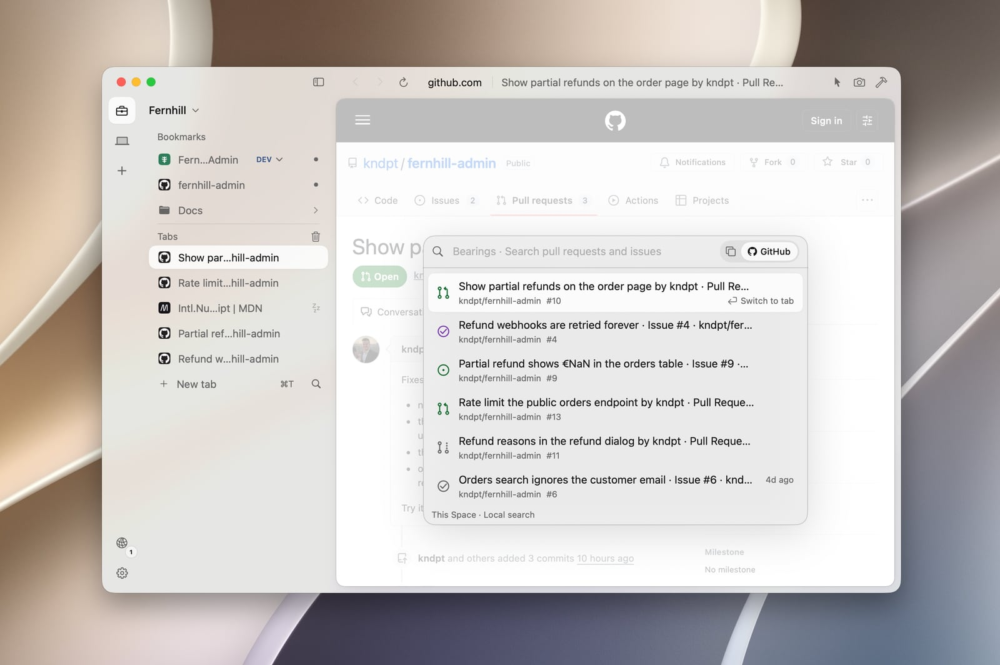

<p align="center">
  <picture>
    <source media="(prefers-color-scheme: dark)" srcset="docs/brand/mark-cream.svg">
    
  </picture>
</p>

<h1 align="center">Escale</h1>

<p align="center">
  A native browser for developers on Mac.<br>
  Built in Swift, on WebKit, for the pages around your code.
</p>

<p align="center">
  <a href="https://escalebrowser.com/download"><strong>Download for Mac</strong></a>
  &nbsp;·&nbsp; Apple silicon, macOS 14 or later &nbsp;·&nbsp;
  <a href="CHANGELOG.md">Changelog</a>
  &nbsp;·&nbsp;
  <a href="https://escalebrowser.com">escalebrowser.com</a>
</p>

<p align="center">
  <a href="https://github.com/kndpt/escale-browser/releases/latest"></a>
  <a href="LICENSE"></a>
  <a href="https://github.com/kndpt/escale-browser/actions/workflows/ci.yml"></a>
</p>



Documentation, pull requests, dashboards and the app on localhost. Escale keeps
each project's pages in a space of its own, and gets you back to them from the
keyboard. It is free, open source, needs no account and sends nothing about
you.

## Where was that pull request?

Press <kbd>⇧⌘K</kbd>. Bearings finds the pull requests and issues you have
seen in this space, in an open tab, a sleeping one or only in its history. One
line each, with whether it is open, draft, merged or closed. Return takes you
back to its tab, or reopens its last address.

- **No account to start.** The state is read from a GitHub page already open
  in a tab, without waking it. An older state stays visible, dimmed, with its
  age.
- **Connect a space to keep it current.** In Settings › GitHub. The lines on
  screen are then refreshed from GitHub, private repositories too once you add
  them. Never what you type, nor repositories you have not visited.
- **A mode, not another place.** From <kbd>⌘K</kbd> or <kbd>⌘T</kbd>, press
  <kbd>Tab</kbd>: the capsule at the end of the field switches to GitHub, and
  what you typed stays.

## Bearings, one bar from the keyboard

| | |
|---|---|
| <kbd>⌘T</kbd> | Go somewhere new, starting from this space: its open tabs, bookmarks and their environments. |
| <kbd>⌘K</kbd> | Switch to an open tab, by name. |
| <kbd>⇧⌘K</kbd> | Find a pull request or issue you have seen on GitHub. |
| <kbd>⌘L</kbd> | Change where this page goes: an address takes you there, words search. |

Bearings works from what is already on your Mac, and learns which result you
pick for what you type. That stays on your Mac; nothing is sent until you
press Return.

## A space for each project


Each space has its own tabs, bookmarks and pinned pages, and its own history,
passwords, cookies and extensions. Restored tabs load their page when you
select them, not before. Tabs sit in the sidebar, or across the top with
<kbd>⇧⌘S</kbd>.

## Is this dev, staging or prod?

Give a bookmark its environments, each an exact address. In Bearings, the
environment you are on is already ringed; <kbd>←</kbd> <kbd>→</kbd> choose
another, Return opens it. The name you chose sits beside the address before
you act. A label is a reminder you set, not a guard.

## Also aboard

- **Hide anything, for good.** <kbd>⇧⌘H</kbd>, then click a cookie banner or
  a newsletter overlay. On that site it stays gone, before the page draws.
- **An ad blocker that runs before the page.** Trackers and ad networks are
  stopped inside WebKit's networking. On by default, off for a site it breaks.
- **The calls beside the page.** <kbd>⌥⌘N</kbd> lists the page's API calls,
  with headers and bodies laid out to read and JSON as a searchable tree. Web
  Inspector stays one shortcut away.
- **Chrome extensions, without Chrome.** Paste a Chrome Web Store link. It runs
  on WebKit's own extension engine, the one Safari uses (macOS 15.4 or later).
- **Passwords and passkeys, in your keychain.** Offered once a sign-in has
  worked, never filled on its own.
- **Bring what you had.** Bookmarks and history from Chrome in a click; local
  profiles from Arc and other Chromium browsers, Firefox, Zen or Orion; Safari
  exports. Into the space you choose.
- **Inspect and capture.** Select an element for its CSS and dimensions
  (<kbd>⌥⌘V</kbd>), or save the page as a PNG (<kbd>⌥⌘S</kbd>). Nothing is
  uploaded.
- **Localhost, by space.** The loopback pages you visited, by host and port.
  No port scanning.
- **Reading mode** (<kbd>⇧⌘R</kbd>), **video that floats above every app**
  (<kbd>⇧⌘P</kbd>), **shortcuts you can change**, light, dark and Escale's own
  warm colours.

## Privacy

No account, no sync, no cloud, no analytics, no telemetry, no crash reports.
Typing in the address bar sends nothing until you press Return.

| What | Where it stays |
|---|---|
| History, bookmarks, open tabs, hidden elements | Files per space, in `~/Library/Application Support/Escale/`. |
| Cookies and site data | A separate WebKit store per space. |
| Passwords | The macOS keychain, tagged by space. |
| GitHub, if you connect a space | Its authorisation in the keychain; the states it has seen in a file of their own, without titles or addresses. |

Besides the pages you open, these are the only requests Escale makes on its
own:

| Request | When | Where | What it sends |
|---|---|---|---|
| Update check | At most once every 20 hours, and on **Check now** in Settings | `escalebrowser.com/appcast.json`, redirected to the latest release here | A plain GET whose User-Agent carries the build and Darwin version. The site counts these per day; no IP, cookie or identifier is kept. |
| Update download | When a newer version exists | GitHub Releases | A plain GET for the ZIP, installed only if its hash and bundle id match and Apple's Developer ID signed it for the same team. Nothing restarts on its own. |
| Site icons | After a page loads | The icon the page declares, or `/favicon.ico` | A GET without cookies or cache, private tabs included. |
| Extensions | When you add one, and its update check at most every 20 hours | Chrome Web Store (`clients2.google.com`) | The extension's id and version, and a fixed Chrome version (`prodversion=140.0.0.0`), the same for everyone. |
| GitHub | Only in a space you connect | `github.com`, `api.github.com` | Sign-in (device flow), then the state of the pull requests and issues on screen. |

Extensions you install can make their own requests, within their permissions.
**Translate** in the selection menu uses Apple's Translation panel: unless the
language is downloaded for offline use, the panel says the text goes to Apple
and waits for you. WebKit's fraudulent website warning stays on, as in Safari,
and may check addresses against Safe Browsing lists.

## Not a fit yet

- Sync across devices, or Windows and Linux.
- Chromium-only tools: Lighthouse, CDP, building Chrome extensions.
- A company-managed Chrome, or an extension WebKit cannot run.

## Install

[escalebrowser.com/download](https://escalebrowser.com/download) always gives
the latest disk image, also on [GitHub Releases](https://github.com/kndpt/escale-browser/releases/latest).
Open it and drag Escale to Applications. Builds are signed and notarised by
Apple, and Escale updates itself.

A Mac with Apple silicon, macOS 14 or later. Chrome extensions need macOS
15.4; translation and hardware security keys need macOS 14.4.

## Build from source

You need Xcode 16.3 or later, or its Command Line Tools. There are no other
dependencies and no Apple developer account is needed.

```sh
git clone https://github.com/kndpt/escale-browser.git
cd escale-browser
./build.sh debug && ./fresh.sh   # build the app and open it in a test world
```

Never open `build/Escale.app` directly: [CONTRIBUTING](CONTRIBUTING.md) explains
why, and how to test a change. [docs/](docs/README.md) describes how Escale is
built.

## Feedback and contributing

In Escale, **Help › Send Feedback…** opens an issue here with your version,
build and macOS filled in; you can also
[open one directly](https://github.com/kndpt/escale-browser/issues/new/choose).
Issues are public: leave out internal addresses, tokens and screenshots of
your work. For anything else, write to contact@escalebrowser.com.

Contributions are welcome: read [CONTRIBUTING](CONTRIBUTING.md) first.
Security problems go through [SECURITY](SECURITY.md). Everyone taking part
follows the [Code of Conduct](CODE_OF_CONDUCT.md).

## License

Escale is free software under the
[GNU General Public License v3.0 or later](LICENSE) (`GPL-3.0-or-later`).

It started from [Search](https://github.com/driceroland/Search), by Office
Commun, under the MIT license; that notice is kept in [NOTICE](NOTICE).
"Search" and its icon belong to Office Commun; Escale uses neither.
Third-party material is listed in [THIRD_PARTY_NOTICES](THIRD_PARTY_NOTICES.md).

The name Escale, its mark and its icon are not covered by the GPL; forks
publish under their own name. See [TRADEMARKS](TRADEMARKS.md).

The pull requests in the picture above belong to
[kndpt/fernhill-admin](https://github.com/kndpt/fernhill-admin), a demo project.
